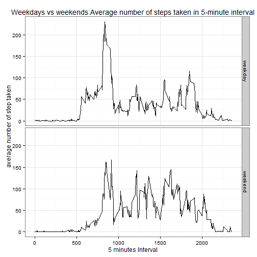

#Introduction

It is now possible to collect a large amount of data about personal movement using activity monitoring devices such as a Fitbit, Nike Fuelband, or Jawbone Up. These type of devices are part of the "quantified self" movement - a group of enthusiasts who take measurements about themselves regularly to improve their health, to find patterns in their behavior, or because they are tech geeks. But these data remain under-utilized both because the raw data are hard to obtain and there is a lack of statistical methods and software for processing and interpreting the data.

This assignment makes use of data from a personal activity monitoring device. This device collects data at 5 minute intervals through out the day. The data consists of two months of data from an anonymous individual collected during the months of October and November, 2012 and include the number of steps taken in 5 minute intervals each day.

#Data

The data for this assignment can be downloaded from the course web site:

Dataset: Activity monitoring data [52K]
The variables included in this dataset are:

steps: Number of steps taking in a 5-minute interval (missing values are coded as NA)

date: The date on which the measurement was taken in YYYY-MM-DD format

interval: Identifier for the 5-minute interval in which measurement was taken

The dataset is stored in a comma-separated-value (CSV) file and there are a total of 17,568 observations in this dataset.

##Loading and preprocessing the data

Show any code that is needed to

1. Load the data (i.e. read.csv())


```r
#Load DataSets in R
activity <- read.csv("C:/Users/DATANALYSIS/Documents/RProgramming/repdata_project1/activity.csv")
```

2. Process/transform the data (if necessary) into a format suitable for your analysis


```r
#Transform in data.table

library(data.table)
datactivity <-data.table(activity)

#Remove NA

dataset <-  datactivity[complete.cases(datactivity),]
```

##What is mean total number of steps taken per day?

For this part of the assignment, you can ignore the missing values in the dataset.

1. Calculate the total number of steps taken per day


```r
#Calculate the total number of steps taken per day
StepDay <- aggregate(dataset$steps, by = list(day = dataset$date), sum)
```

2. Make a histogram of the total number of steps taken each day


```r
#Make a histogram of the total number of steps taken each day

hist(StepDay$x, xlab = "number of steps", main = "Histogram of the total number of steps taken each day")
```

 

3. Calculate and report the mean and median of the total number of steps taken per day


```r
#Calculate and report the mean and median of the total number of steps taken per day

meanstepday <- round(mean(StepDay$x))
medianstepday <- median(StepDay$x)

meanstepday
```

```
## [1] 10766
```

```r
medianstepday
```

```
## [1] 10765
```

The mean number of step taken per day is 10766.19 and the median number is 10765

##What is the average daily activity pattern?

1. Make a time series plot (i.e. type = "l") of the 5-minute interval (x-axis) and the average number of steps taken, averaged across all days (y-axis)


```r
#Aggregate the data by interval
StepInterval <- aggregate(dataset$steps, by = list(interval = dataset$interval), mean)

#Create a plot
plot(StepInterval$x~StepInterval$interval, type = "l", col = "blue", xlab = "5 minutes Interval", ylab = "average number of step taken", main = "Average number of steps taken in 5-minute interval across all days")
```

 

2. Which 5-minute interval, on average across all the days in the dataset, contains the maximum number of steps?


```r
#Identify the interval with the maximum number of steps
maxinterval <- StepInterval[ which.max(StepInterval$x),1]
```

The interval which contain the max number of steps is 835

##Imputing missing values

Note that there are a number of days/intervals where there are missing values (coded as NA). The presence of missing days may introduce bias into some calculations or summaries of the data.

1. Calculate and report the total number of missing values in the dataset (i.e. the total number of rows with NAs)

```r
#Calculate the number of rows with NAs
na_number<-sum(!complete.cases(datactivity))
```

There are 2304 rows with missing values.

2. Devise a strategy for filling in all of the missing values in the dataset. The strategy does not need to be sophisticated. For example, you could use the mean/median for that day, or the mean for that 5-minute interval, etc.

For performing imputation, we replace the NA by the mean for that 5-minute interval. We already have this data calculated previously.

3. Create a new dataset that is equal to the original dataset but with the missing data filled in.


```r
#Saving the dataset with missing values
preprocessed <-datactivity

#Replacing the NAs with the interval mean step number
for (i in 1:nrow(datactivity)){
  if (is.na(datactivity$steps[i])){
    interval_val <- datactivity$interval[i]
    row_id <- which(StepInterval$interval == interval_val)
    steps_val <- StepInterval$x[row_id]
    datactivity$steps[i] <- steps_val
  }
}
clean_data <- datactivity
```

4. Make a histogram of the total number of steps taken each day and Calculate and report the mean and median total number of steps taken per day. Do these values differ from the estimates from the first part of the assignment? What is the impact of imputing missing data on the estimates of the total daily number of steps?


```r
#Aggregate the data by date
cleanactivity <- aggregate(clean_data$steps, by = list(day = clean_data$date), sum)

#Create plot
hist(cleanactivity$x, xlab = "number of steps", main = "Histogram of the total number of steps taken each day")
```

 

```r
#Calculate and report the mean and median of the total number of steps taken per day

meanstepdayclean <- mean(cleanactivity$x)
medianstepdayclean <- median(cleanactivity$x)

meanstepdayclean
```

```
## [1] 10766.19
```

```r
medianstepdayclean
```

```
## [1] 10766.19
```

The mean number of step is 10766.19 after NA replacement compared to 10766.19 before replacement.
The median number of step is 10766.19 after NA replacement compared to 10765

*The NA replacement as stightly increased the median number of steps while the mean number of steps has remained the same*

##Are there differences in activity patterns between weekdays and weekends?

For this part the weekdays() function may be of some help here. Use the dataset with the filled-in missing values for this part.

1. Create a new factor variable in the dataset with two levels - "weekday" and "weekend" indicating whether a given date is a weekday or weekend day.

```r
# convert date from string to Date class
clean_data$date <- as.Date(clean_data$date, "%Y-%m-%d")

# add a new column indicating day of the week 
clean_data$name_day <- weekdays(clean_data$date)

# add a new column called day type and initialize to weekday
clean_data$type_of_day <- c("weekday")

# If day is Saturday or Sunday, make day_type as weekend
for (i in 1:nrow(clean_data)){
  if (clean_data$name_day[i]== "samedi" || clean_data$name_day[i] == "dimanche"){
    clean_data$type_of_day[i] <- "weekend"
  } 
}

# convert day_time from character to factor
clean_data$type_of_day <- as.factor(clean_data$type_of_day)
```

2. Make a panel plot containing a time series plot (i.e. type = "l") of the 5-minute interval (x-axis) and the average number of steps taken, averaged across all weekday days or weekend days (y-axis).


```r
# calculate average steps by interval across all days
clean_Stepinterval <- aggregate(steps ~ interval + type_of_day, clean_data, mean)

#load ggplot library
library(ggplot2)
```

```
## Warning: package 'ggplot2' was built under R version 3.1.3
```

```r
#Create plot
graph <- ggplot(clean_Stepinterval, aes(interval,steps))
graph + geom_line() +facet_grid (type_of_day~.) + theme_bw() + labs(x = "5 minutes Interval") + labs(y = "average number of step taken") + labs(title = "Weekdays vs weekends:Average number of steps taken in 5-minute interval")
```

 
